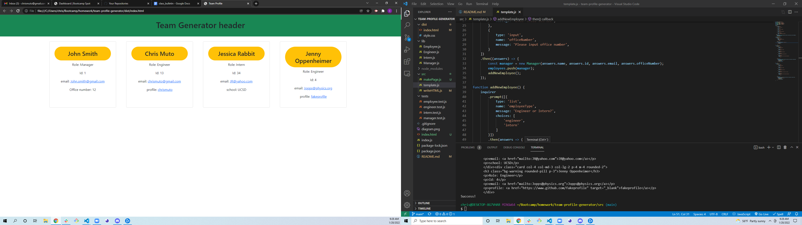

# Team Profile Generator

## Description

An app that generates a web page displaying all the names, roles, ids and special information for each team member entered in a node prompt. The node prompt asks for all the information and dynamically generates the entire index.html.

## [Try it yourself!]

The following image show a glimpse of the application:

Video example: https://watch.screencastify.com/v/zOYXYFJyEyOysA3hNiQt

## Getting Started

This application requires the installation of the inquirer and fs dependencies in Node.

## Built With:

Node.js  
express.js  
JavaScript  
Bootstraps

## Author:

Chris Muto

## Planned Updates

There are no plans to further update this application at this time.